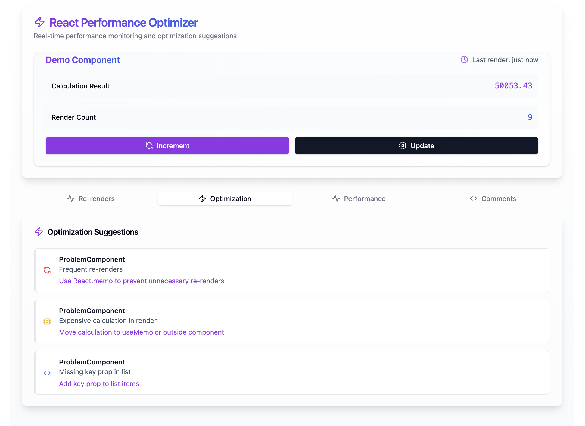

# react-perf-optimizer

A comprehensive React performance optimization toolkit that automatically detects, analyzes, and provides solutions for performance bottlenecks in your React applications.


### Demo of what the code does
Video:

https://github.com/user-attachments/assets/45d5398e-4e71-4580-a844-420d1d214680


<table>
  <tr>
    <td align="center">
      
    </td>
    <td align="center">
      
    </td>
  </tr>
  <tr>
    <td align="center">
      
    </td>
    <td align="center">
      
    </td>
  </tr>
</table>

## Features

🔍 **Real-time Performance Monitoring**
- Component render tracking
- Props change detection
- Memory usage analysis
- Bundle size monitoring
- Automatic bottleneck detection

⚡ **Automated Optimization Suggestions**
- Memoization opportunities
- Code splitting recommendations
- Component render optimization
- State management improvements
- Bundle size reduction tips

📊 **Performance Visualization**
- Component render tree
- Performance metrics dashboard
- Historical performance data
- Bundle size analysis
- Memory usage graphs

🔧 **Developer Tools**
- Chrome DevTools extension
- VS Code integration
- CI/CD pipeline integration
- Custom ESLint rules
- Performance regression testing

## Installation

```bash
npm install react-perf-optimizer

# or with yarn
yarn add react-perf-optimizer
```

## Quick Start

1. Wrap your app with the Performance Provider:

```jsx
import { PerformanceProvider } from 'react-perf-optimizer';

function App() {
  return (
    <PerformanceProvider>
      <YourApp />
    </PerformanceProvider>
  );
}
```

2. Monitor specific components:

```jsx
import { withPerformanceTracking } from 'react-perf-optimizer';

function MyComponent() {
  return <div>My Component</div>;
}

export default withPerformanceTracking(MyComponent);
```

3. Access performance metrics:

```jsx
import { usePerformanceMetrics } from 'react-perf-optimizer';

function PerformancePanel() {
  const metrics = usePerformanceMetrics();
  return (
    <div>
      <h2>Performance Metrics</h2>
      <pre>{JSON.stringify(metrics, null, 2)}</pre>
    </div>
  );
}
```

### CLI Commands

```bash
# Install the package
npm install react-perf-optimizer

# Analyze component with all features
npx react-perf-optimizer analyze ./src/components/MyComponent.js -r -m -p

# Remove comments and create backup
npx react-perf-optimizer analyze ./src/components/MyComponent.js -c

# Get memoization suggestions only
npx react-perf-optimizer analyze ./src/components/MyComponent.js -m
```

## Configuration

Create a `perf-optimizer.config.js` file in your project root:

```javascript
module.exports = {
  thresholds: {
    renderDuration: 16, // ms
    memoryUsage: 50 * 1024 * 1024, // 50MB
    bundleSize: 244 * 1024, // 244KB
  },
  monitoring: {
    enabled: true,
    interval: 1000,
    trackProps: true,
    trackState: true,
    trackEvents: true,
  },
};
```


### PerformanceProvider

The root provider that enables performance monitoring.

```jsx
<PerformanceProvider
  config={config}
  onAlert={handleAlert}
  onMetricsUpdate={handleMetricsUpdate}
>
  {children}
</PerformanceProvider>
```

### withPerformanceTracking

HOC for monitoring individual components.

```jsx
withPerformanceTracking(Component, options);
```

Options:
- `trackProps`: Boolean
- `trackState`: Boolean
- `trackEvents`: Boolean
- `customMetrics`: Array
- `thresholds`: Object

### Hooks

```jsx
// Get performance metrics
const metrics = usePerformanceMetrics();

// Track custom metrics
const track = usePerformanceTracker();

// Get optimization suggestions
const suggestions = useOptimizationSuggestions();
```

### GitHub Actions

```yaml
name: Performance Checks

on: [push, pull_request]

jobs:
  performance:
    runs-on: ubuntu-latest
    steps:
      - uses: actions/checkout@v2
      - name: Install dependencies
        run: npm install
      - name: Run performance tests
        uses: react-perf-optimizer/github-action@v1
        with:
          thresholds: |
            {
              "bundleSize": "244KB",
              "renderTime": "16ms"
            }
```
## Best Practices

1. **Component Optimization**
   - Use memoization for expensive calculations
   - Implement `React.memo` for pure components
   - Optimize event handlers with `useCallback`
   - Use `useMemo` for expensive derivations

2. **State Management**
   - Keep state as local as possible
   - Use appropriate state management tools
   - Implement proper state splitting
   - Optimize context usage

3. **Bundle Optimization**
   - Implement code splitting
   - Use dynamic imports
   - Optimize dependencies
   - Configure proper splitting points

## Contributing

1. Fork the repository
2. Create your feature branch
3. Submit a pull request

## License

MIT © Divit Patidar

